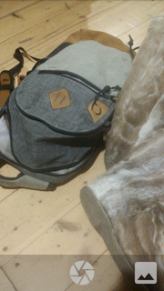
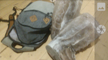
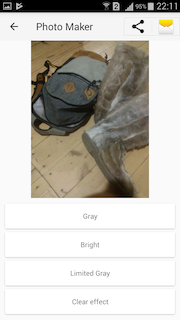
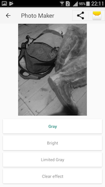
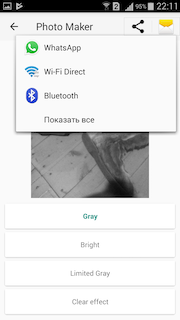
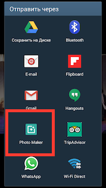

Photo Maker
===========

Demonstration of Camera and Bitmap's visual effects

Install Demo App from [GooglePlay][11]

[][11]

How does it work?
-----------------

### CameraActivity
When you start Photo Maker you'll see this activity. 

Activity supports landscape mode:

After taking photo, or choosing existing one you will automatically redirected to:

### PhotoEffectActivity

### Visual effect (handwritten algorithm)
You will find that you can apply one of these visual effects to Image. For example, "Gray::

### ShareProvider

When you click on the "Share" button you'll see that it really works:

### IntentFilter

Close PhotoMaker App, and open any photo in your device's Gallery. If you now click on "Share" you'll see that App is here:

Modules
-------
- ContentProvider to share with result picture after using visual effect
- IntentFilter for recieve any image-file
- RecyclerView and advanced adapter practice
- Camera and SurfaceView (NOTE! It's not Camera2)
- BitmapFactory
- ShareActionProvider with FileProvider. For save shared file used EnvironmentExternalPublic.Picture folder

Architecture
------------
Project is designed to being easy for extention and using in real Android projects. Here are packs:
- utils/ common methods for work with bitmap and common temp file
- adapter/ here might be adapters and it's ViewHolders
- ui/ activities and fragments in future
- effect/ interface and class for effects. If you want to create new effect, you have to implement interface Effect

Activities
----------
- CameraActivity previews in SurfaceView what happened in camera, and can take a photo. 
Also you can open existing image from gallery(or same other app in device). After taking a photo or opening an existing image, it starts the second activity
- PhotoEffectActivity is the main-targeted module that works with visual effects using image's Bitmap. You can apply image-filters to image. 
This activity available for other external apps from your device. You can send image file from other app by click "Share" function

Permissions
--------------
There are two permissions required in App: CAMERA, WRITE_EXTERNAL_STORAGE(SD).
When CameraActivity starting it require permission for SD at first. If permission will not be grant then App finish itself.
When user grands camera-permission it starts to require second SD permission. SD-permission is unlike of camera-permission doesn't finish App even when user deny required camera permission,
instead of that it shows the TextView with static message. That is necessary for user to open an existing photo from the gallery

IntentProvider
--------------
You can send any image to Photo Maker app, using "Share" function from other Apps. 
You can open photo from WatsApp. Apply visual effect to opened photo. And share the modified photo back to the WatsApp

Disadvantages
-------------
- Bitmap's perform is very slow. 
Author reduce image size to ~400 pixels, cause the time of compute new bitmap with effect is very long. 
You can change the size of redusing in src/CommonSettings. Also you can really optize effects algorithm in src/effects/

- CameraActivity orientation change is slow. Because author didn't optimize

UI
--
- Used standart Material Design elements provided by SupportLibrary

Links
-----

- [chrisbanes/PhotoView][1] used in PhotoFiltersActivty to zoom image

License
-------

See the [LICENSE](LICENSE) file for license rights and limitations (Apache).

[1]:https://github.com/chrisbanes/PhotoView
[11]:https://play.google.com/store/apps/details?id=com.ivanov.tech.photomaker
